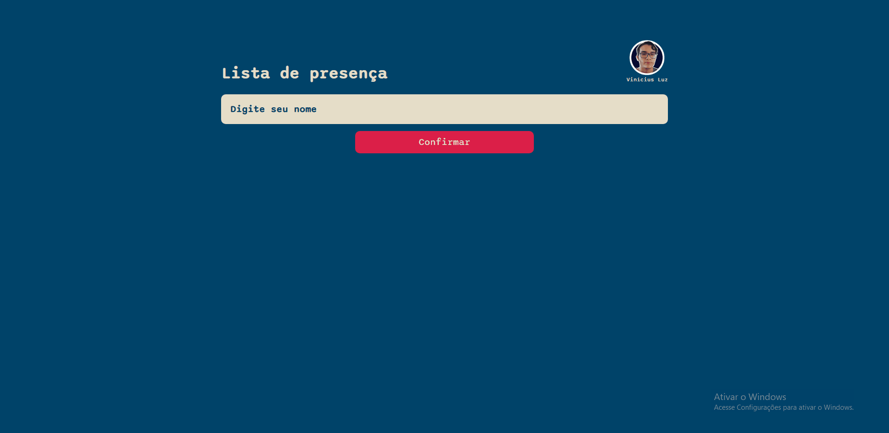

# Projeto lista de presença 🪙 ✔️ 

- 💻 Olá, comunidade, desenvolvi um projeto simples com React js, que servirá como uma ferramenta para, por exemplo, um professor utilizar em sala de aula como uma lista de presença. Funcionalmente o usuário entra com o nome dos presentes no evento no campo “inserir nome”, e, em seguida, pressiona o botão confirmar, após isto, surgirá um campo com o nome digitado e o horário de confirmação. 

- Com este projeto foi possível praticar conceitos importantes do React como: Componentes, Hooks, propriedades, etc. 
 

<h1 align="center">
    
</h1>

 

## 🛠 &nbsp;Tecnologias utilizadas:

&nbsp;
&nbsp;
&nbsp;
&nbsp;
&nbsp;

  

## 👨🏽‍🦲 &nbsp;Autor do projeto: Vinícius Luz; Meu linkedin:

